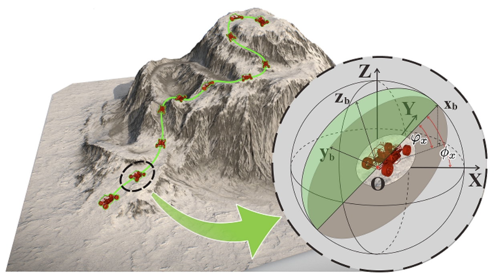
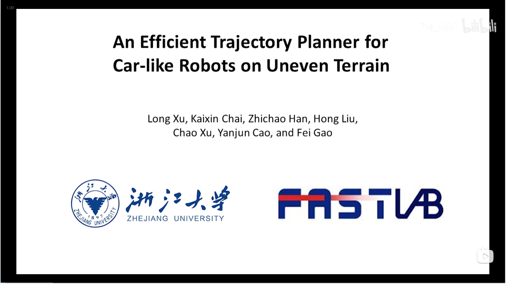

# An-Efficient-Trajectory-Planner-for-Car-like-Robots-on-Uneven-Terrain
Uneven terrain path planning. Submission to IROS2023.
## Introduction
Autonomous navigation of ground robots on uneven terrain is being considered in more and more tasks. However, uneven terrain will bring two problems to motion planning: how to assess the traversability of the terrain and how to cope with the dynamics model of the robot associated with the terrain. The trajectories generated by existing methods are often too conservative or cannot be tracked well by the controller since the second problem is not well solved. In this paper, we propose terrain pose mapping to describe the impact of terrain on the robot. With this mapping, we can obtain the SE(3) state of the robot on uneven terrain for a given state in SE(2). Then, based on it, we present a trajectory optimization framework for car-like robots on uneven terrain that can consider both of the above problems. The trajectories generated by our method conform to the dynamics model of the system without being overly conservative and yet able to be tracked well by the controller. We perform simulations and real-world experiments to validate the efficiency and trajectory quality of our algorithm.

As the **above Figure** shows, the proposed metric is used to identify localization-friendly areas. Figure (c) illustrates the complete scene, while Figures (a) and (b) depict localized views within the scene. Figure (d) shows the result of evaluating this scenario using the proposed metric, where larger values indicate poorer observation quality and areas with a value of 0.0 indicate obstacles. The main sensor of the localization system is a rotating LiDAR, and the observation equation of the localization system is defined as the distance between the LiDAR point and the nearest plane.

## vedio
Click on the image below to watch the experimental video:

## preprint paper
The paper is submitted to ICRA2024, which is under review now. Click [here](archieve/ICRA2024_Perception_Aware.pdf) to see the preprint version.
